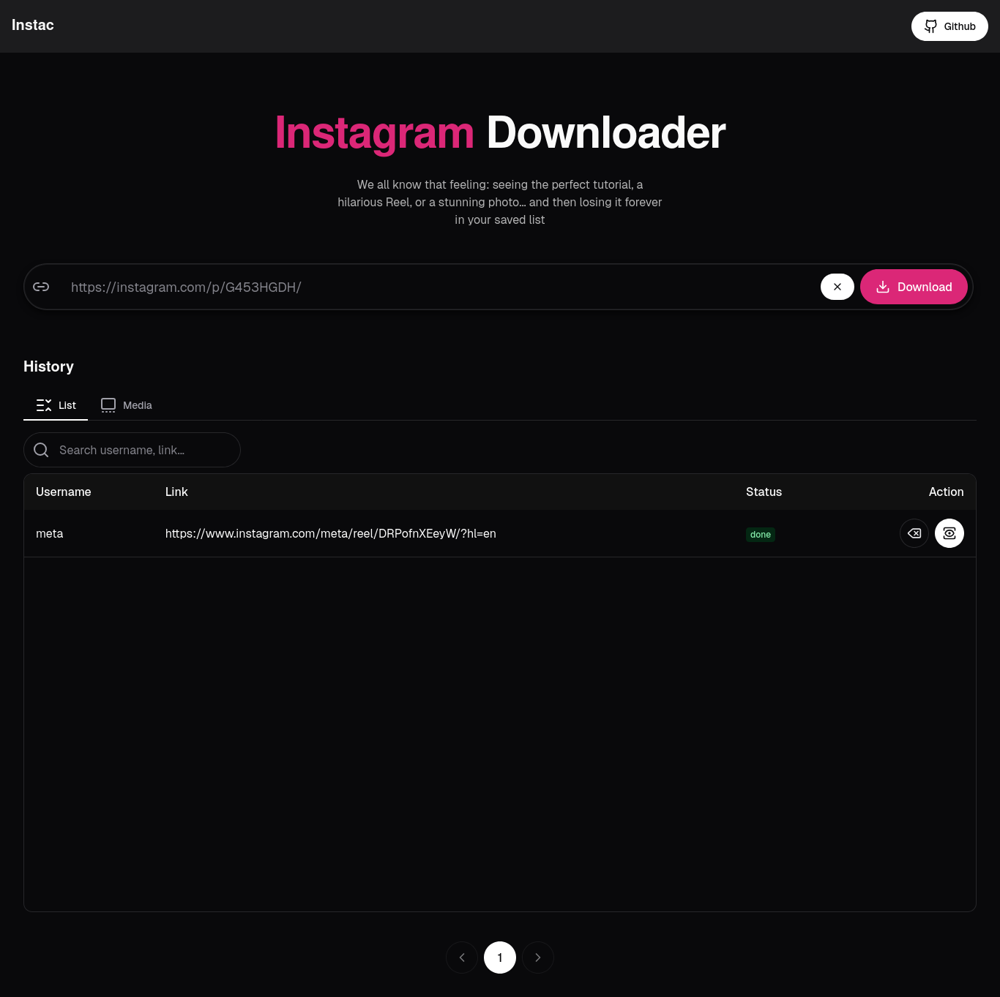

# Instac - Instagram Downloader

Instac is a self-hosted Instagram media downloader that allows you to download photos and videos easily.



## Installation

1. Download the `docker-compose.yml` file:

   ```bash
   wget https://raw.githubusercontent.com/hwisnu222/instac/refs/heads/main/docker-compose.yml
   ```

2. Run the containers:

   ```bash
   docker-compose up -d
   ```

3. Open your browser and go to:

   ```
   <ip-address>:8083
   ```

   (Adjust the port if needed based on your configuration.)

## Stop and remove containers

To stop the application:

```bash
docker-compose down
```
